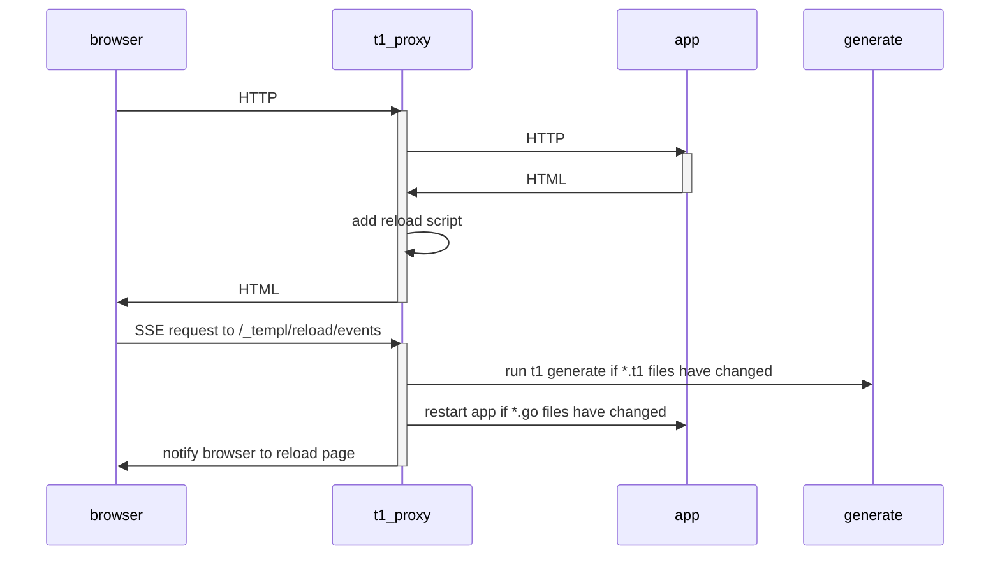

# Hot reload

To access a Go web application that uses t1 in a web browser, a few things must happen:

1. `t1 generate` must be executed, to create Go code (`*_t1.go` files) from the `*.t1` files.
2. The Go code must start a web server on a port, e.g. (`http.ListenAndServe("localhost:8080", nil)`.
3. The Go program must be ran, e.g. by running `go run .`.
4. The web browser must access or reload the page, e.g. `http://localhost:8080`.

If the `*.t1` files change, #1 and #2 must be ran.

If the `*.go` files change, #3 and #4 must be ran.

## Built-in

`t1 generate --watch` watches the current directory for changes and generates Go code if changes are detected.

`t1 generate --watch` generates Go code that loads strings from a `_t1.txt` file on disk to reduce the number of times that Go code needs to be re-generated, and therefore reduces the number of time your app needs to be recompiled and restarted.

To re-run your app automatically, add the `--cmd` argument to `t1 generate`, and t1 will start or restart your app using the command provided once template code generation is complete (#3).

Finally, to trigger your web browser to reload automatically (without pressing F5), set the `--proxy` argument (#4).

The `--proxy` argument starts a HTTP proxy which proxies requests to your app. For example, if your app runs on port 8080, you would use `--proxy="http://localhost:8080"`. The proxy inserts client-side JavaScript before the `</body>` tag that will cause the browser to reload the window when the app is restarted instead of you having to reload the page manually. Note that the html being served by the webserver MUST have a `<body>` tag, otherwise there will be no javascript injection thus making the browser not reload automatically.

Altogether, to setup hot reload on an app that listens on port 8080, run the following.

```
t1 generate --watch --proxy="http://localhost:8080" --cmd="go run ."
```

```go title="main.go"
package main

import (
	"fmt"
	"net/http"

	"github.com/senforsce/tndr"
)

func main() {
	component := hello("World")

	http.Handle("/", t1.Handler(component))

	fmt.Println("Listening on :8080")
	http.ListenAndServe(":8080", nil)
}
```

```t1 title="hello.t1"
package main

t1 hello(name string) {
  <body>
	    <div>Hello, { name }</div>
  </body>
}
```

The hot reload process can be shown in the following diagram:



## Alternative 1: wgo

[wgo](https://github.com/bokwoon95/wgo):

> Live reload for Go apps. Watch arbitrary files and respond with arbitrary commands. Supports running multiple invocations in parallel.

```
wgo -file=.go -file=.t1 -xfile=_t1.go t1 generate :: go run main.go
```

To avoid a continous reloading files ending with `_t1.go` should be skipped via `-xfile`.

## Alternative 2: air

Air's reload performance is better than templ's built-in feature due to its complex filesystem notification setup, but doesn't ship with a proxy to automatically reload pages, and requires a `toml` configuration file for operation.

See https://github.com/cosmtrek/air for details.

### Example configuration

```toml title=".air.toml"
root = "."
tmp_dir = "tmp"

[build]
  bin = "./tmp/main"
  cmd = "t1 generate && go build -o ./tmp/main ."
  delay = 1000
  exclude_dir = ["assets", "tmp", "vendor"]
  exclude_file = []
  exclude_regex = [".*_t1.go"]
  exclude_unchanged = false
  follow_symlink = false
  full_bin = ""
  include_dir = []
  include_ext = ["go", "tpl", "tmpl", "templ", "html"]
  kill_delay = "0s"
  log = "build-errors.log"
  send_interrupt = false
  stop_on_error = true

[color]
  app = ""
  build = "yellow"
  main = "magenta"
  runner = "green"
  watcher = "cyan"

[log]
  time = false

[misc]
  clean_on_exit = false
```
